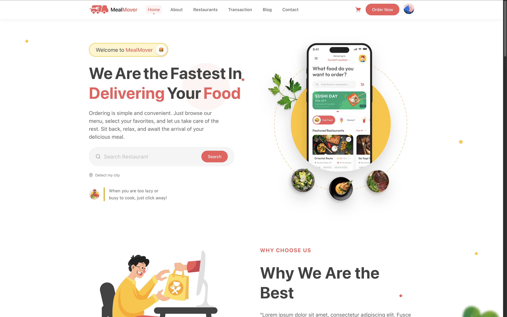
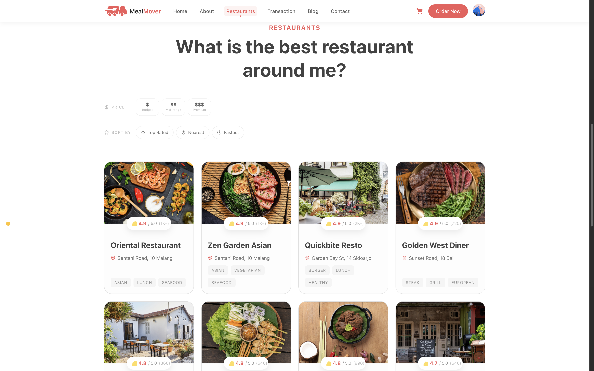
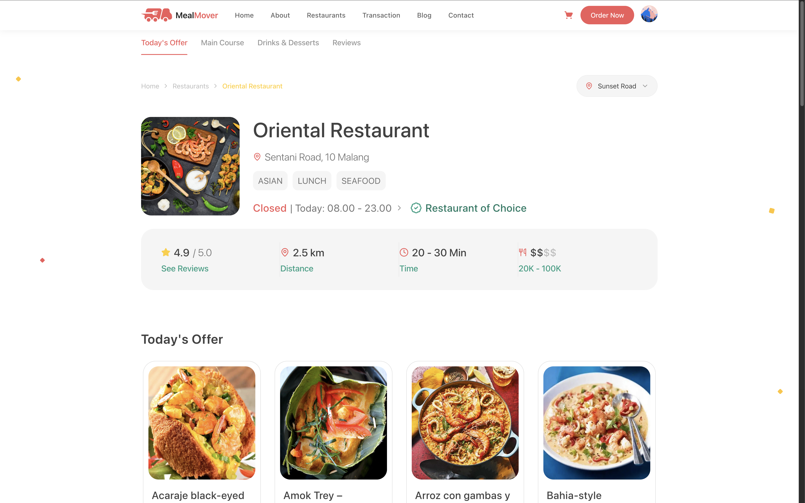
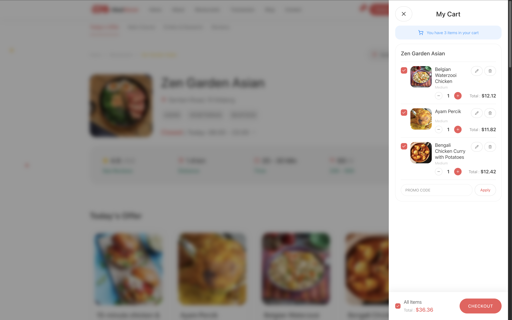
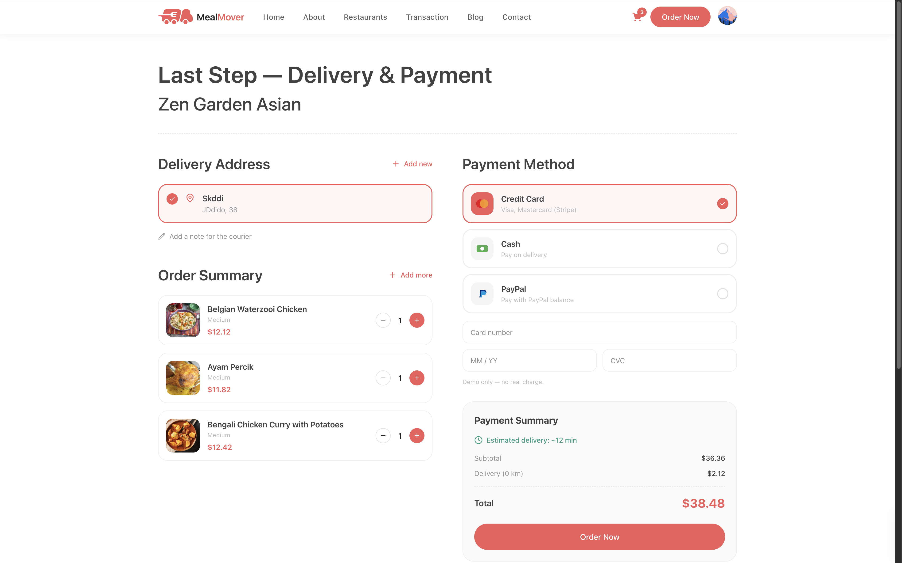
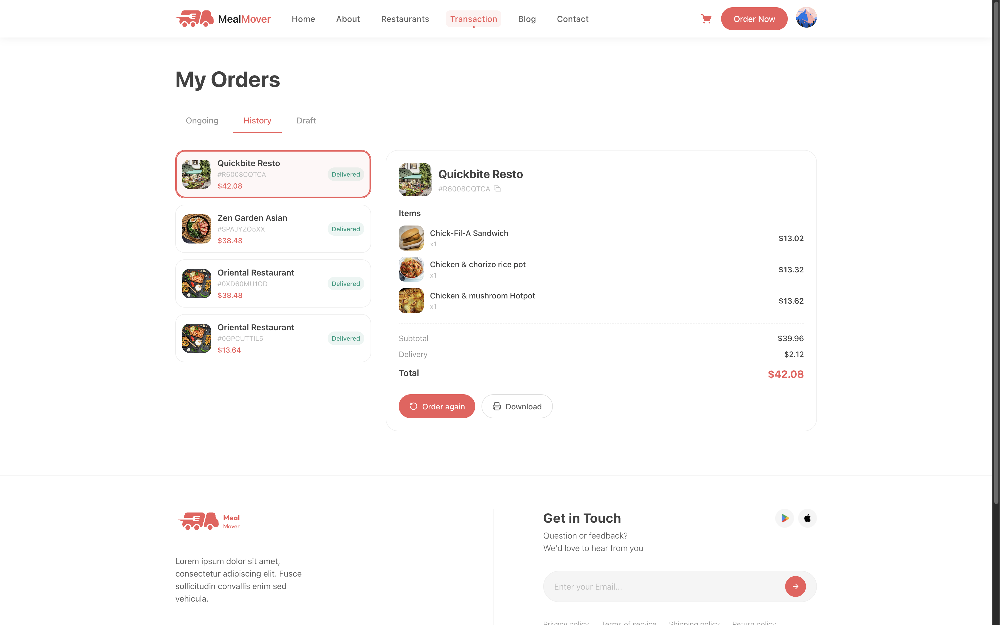
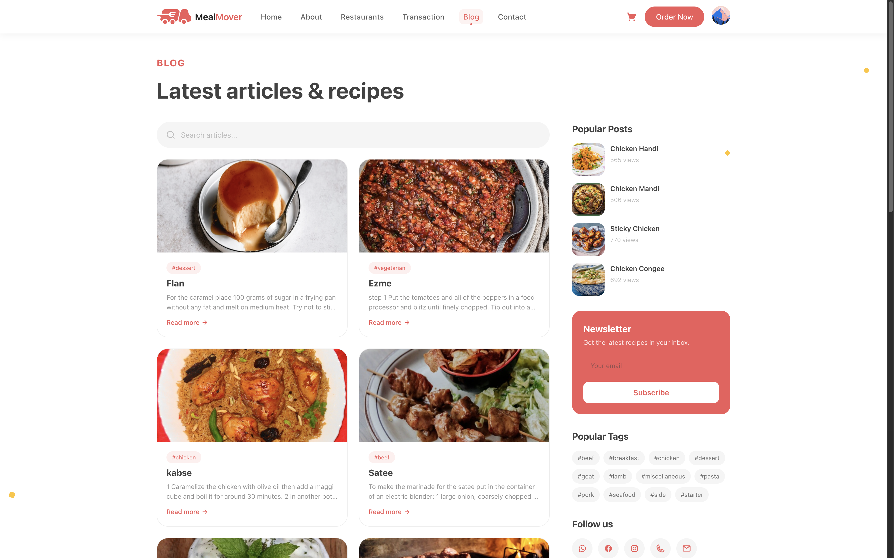
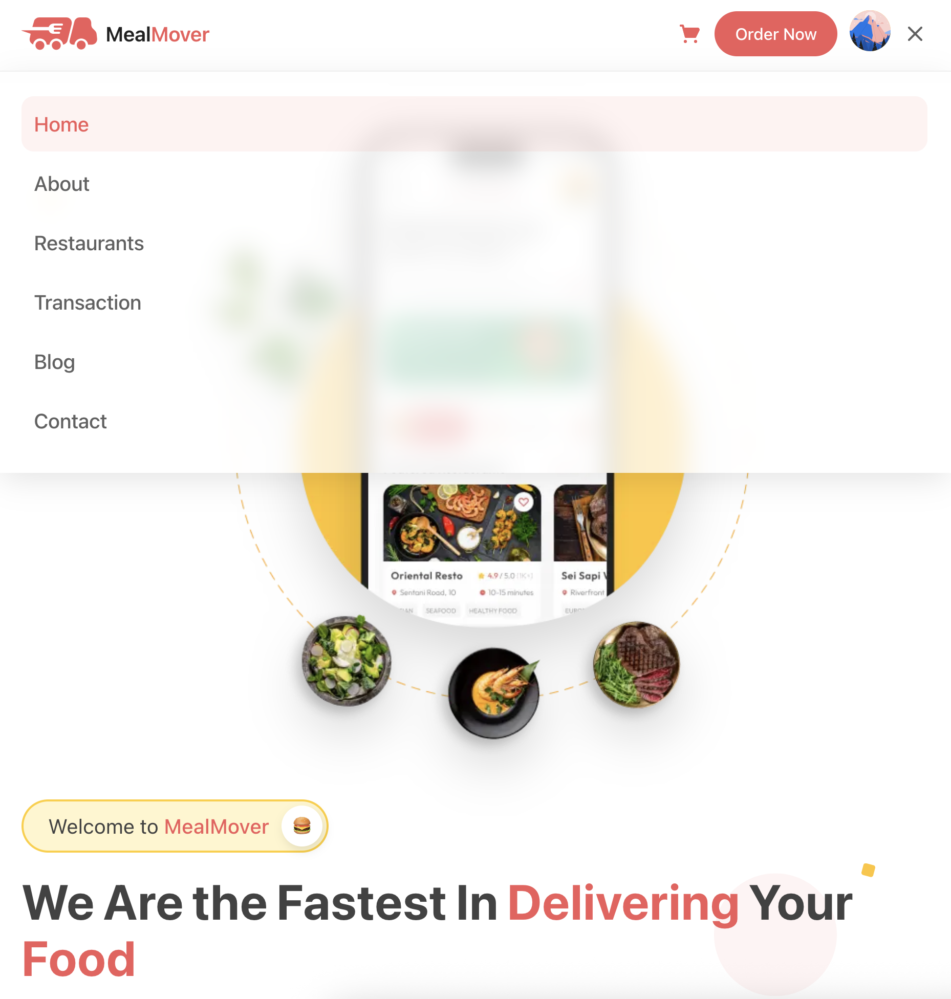

<div align="center">


# MealMover

**A full-stack food-delivery platform built with the Next.js App Router, React Server Components, Prisma & PostgreSQL.**

Restaurant discovery, live menus, a persistent cart, authentication, and a complete checkout flow — built as a production-minded portfolio project.

[](https://nextjs.org)
[](https://react.dev)
[](https://www.typescriptlang.org)
[](https://www.prisma.io)
[](https://neon.tech)
[](https://tailwindcss.com)
[](#license)

[Live Demo](https://mealmover-5va8.vercel.app) · [Report Bug](../../issues) · [Request Feature](../../issues)

</div>

---

## Overview

MealMover is a food-delivery web app that lets a guest browse restaurants, filter and search a live menu imported from a public food API, build a cart that survives page reloads, sign in with Google, GitHub or email, and move through a full checkout and order-history flow.

The goal of the project is to demonstrate real production patterns — server-first data fetching with React Server Components, type safety from the database schema all the way to the form, URL-driven filter state, and a clean feature-based architecture — rather than a UI-only demo.

---

## Screenshots

> Save the images below into `public/README/` using the exact filenames shown, and they will render here automatically.

| Homepage | Restaurants |
|:---:|:---:|
|  |  |
| **Restaurant detail** | **Cart drawer** |
|  |  |
| **Checkout** | **Transaction history** |
|  |  |
| **Blog** | **Mobile menu** |
|  |  |

**Filenames to save into `public/README/`:**

- `home.png` — homepage hero + food categories
- `restaurants.png` — restaurants grid with filters
- `restaurant-detail.png` — a single restaurant with its menu
- `cart.png` — the cart drawer open with a few items
- `checkout.png` — the checkout page
- `transactions.png` — the transaction / order history page
- `blog.png` — the blog list page
- `mobile-menu.png` — the animated burger menu on a narrow viewport

*(Tip: capture at ~1440px wide for desktop shots and ~390px for the mobile one, then compress with [Squoosh](https://squoosh.app) so the README stays light.)*

---

## Features

### Authentication
- Sign in with **Google**, **GitHub**, or **email + password** via NextAuth v5.
- Passwords hashed with bcrypt; sessions available inside Server Components.
- Protected routes (`/checkout`, `/transactions`, `/profile`) guarded by middleware with return-to-page redirect after login.
- Avatar and profile dropdown in the header when authenticated.

### Restaurants & menu
- Restaurant catalog rendered on the server (React Server Components) from the database.
- Menu items imported once from **TheMealDB** into PostgreSQL, so filtering, sorting and pagination happen in the database rather than against a rate-limited external API.
- Restaurant detail page with menu sections, stats panel (rating / distance / time / price) and a location map.
- Search endpoint (`/api/search`) with debounced queries.

### Cart & ordering
- Guest cart on **Zustand** persisted to `localStorage` — survives reloads.
- Slide-in cart drawer with quantity stepper, per-item selection, and live totals.
- Checkout page with delivery addresses, order summary and payment-method selection.
- Transaction history with History / Ongoing / Draft tabs.
- **Fly-to-cart** animation and an animated cart badge for tactile feedback.

### Content pages
- **Blog** — list, detail and comments, with data sourced from a public API, validated with Zod and cached in Upstash Redis.
- **About** and **Contact** pages, with a contact form and an embedded map.
- Custom **404** page.

### UX & polish
- Animated, semi-transparent mobile menu (Motion) that layers over the page with a blurred backdrop.
- Smooth scrolling (Lenis) and scroll-reveal / hero animations (GSAP + ScrollTrigger).
- Sticky header, toast notifications, skeleton loading states.
- Fully responsive from mobile to desktop; `prefers-reduced-motion` respected.

---

## Tech Stack

| Layer | Technology |
|---|---|
| **Framework** | Next.js 16 (App Router, RSC, Server Actions, Route Handlers) |
| **UI** | React 19, Tailwind CSS v4, `clsx` + `tailwind-merge` (`cn()` helper) |
| **Language** | TypeScript (strict) |
| **Database** | PostgreSQL (Neon) + Prisma 7 |
| **Auth** | NextAuth v5 + Prisma adapter + bcryptjs |
| **Validation** | Zod 4 (shared client/server schemas) |
| **Forms** | React Hook Form + Zod resolvers |
| **Client state** | Zustand (cart, UI) |
| **Server state** | TanStack Query (infinite scroll, search) |
| **Virtualization** | TanStack Virtual (long review / order lists) |
| **URL state** | nuqs (filters in the URL) |
| **Animation** | Motion, GSAP + ScrollTrigger, Lenis |
| **3D** | Three.js + React Three Fiber + drei |
| **Maps** | Mapbox GL / react-map-gl |
| **Caching / rate limit** | Upstash Redis + Ratelimit |
| **Email** | Resend + React Email |
| **Notifications** | react-hot-toast |
| **Testing** | Vitest + Testing Library, Playwright |

---

## Architecture

The app follows a **feature-based** structure. Server-only data access lives in `features/*/queries.ts` and mutations in `features/*/actions.ts`, keeping the boundary between server and client explicit.

```
src/
├─ app/
│  ├─ api/            route handlers: auth, search, meals, orders, reviews, ...
│  ├─ about/ blog/ restaurants/ checkout/ transactions/ contact/ sign-in/ sign-up/
│  ├─ layout.tsx · not-found.tsx · globals.css
├─ components/        ui/ · layout/ · home/ · restaurants/ · blog/ · cart/ · ...
├─ features/          cart/ · orders/ · reviews/ · blog/ · auth/  (queries · actions · schema)
├─ lib/               prisma · auth · redis · email · utils
├─ hooks/  stores/  emails/  types/
prisma/  ├─ schema.prisma  └─ seed.ts
```

**Why these choices**

- **RSC for the catalog and menu** — data is fetched on the server, so the client ships less JavaScript and gets a better LCP. Interactivity (cart, filters, map) stays client-side.
- **nuqs for filters** — filter state lives in the URL, so links are shareable and the back button works.
- **Zustand over Context for the cart** — the cart updates frequently; Context would re-render the whole tree.
- **Menu data imported into the DB** — a public food API can't do price filters, joins or pagination, so meals are imported once and owned locally.
- **Server-side money** — order totals are computed on the server from database values, never trusted from the client.

---

## Getting Started

### Prerequisites

- Node.js 20+
- A PostgreSQL database (a free [Neon](https://neon.tech) project works)
- Accounts (all free tiers) for the services you want to enable: Google & GitHub OAuth, Upstash, Resend, Mapbox

### 1. Clone & install

```bash
git clone https://github.com/<your-username>/mealmover.git
cd mealmover
npm install
```

### 2. Environment variables

Create a `.env` file in the project root:

```bash
# Database (Neon)
DATABASE_URL="postgresql://..."
DIRECT_URL="postgresql://..."

# Auth
AUTH_SECRET="run: npx auth secret"
AUTH_URL="http://localhost:3000"
GOOGLE_CLIENT_ID=""
GOOGLE_CLIENT_SECRET=""
GITHUB_CLIENT_ID=""
GITHUB_CLIENT_SECRET=""

# Upstash Redis (blog cache + rate limiting)
UPSTASH_REDIS_REST_URL=""
UPSTASH_REDIS_REST_TOKEN=""

# Email (Resend)
RESEND_API_KEY=""

# Maps (Mapbox)
NEXT_PUBLIC_MAPBOX_TOKEN=""
```

### 3. Set up the database

```bash
npm run db:push        # apply the Prisma schema
npx tsx prisma/seed.ts # seed restaurants, menu, users, content
npm run db:studio      # (optional) inspect the data
```

### 4. Run

```bash
npm run dev
```

Open [http://localhost:3000](http://localhost:3000).

**Demo account**

```
email:    demo@mealmover.dev
password: password123
```

---

## Scripts

| Command | Description |
|---|---|
| `npm run dev` | Start the dev server (Turbopack) |
| `npm run build` | Production build |
| `npm run start` | Run the production build |
| `npm run lint` | Lint with ESLint |
| `npm run test` | Unit / component tests (Vitest) |
| `npm run test:e2e` | End-to-end tests (Playwright) |
| `npm run db:push` | Push the Prisma schema to the database |
| `npm run db:studio` | Open Prisma Studio |

---

## Deployment

The app deploys to **Vercel**:

1. Push the repository to GitHub and import it into Vercel.
2. Add every environment variable from the `.env` example above, setting `AUTH_URL` to the production domain.
3. Add the production callback URLs to your Google and GitHub OAuth apps:
   `https://mealmover-5va8.vercel.app/api/auth/callback/google` and `.../github`.
4. `postinstall` runs `prisma generate` automatically during the build.
5. Run the seed once against the production database.

---

## Roadmap

Planned additions, in priority order:

- [ ] **Stripe checkout** — Checkout Session + webhook as the source of truth for payment (the `Order` model already carries a `stripeSessionId`).
- [ ] **Realtime order tracking** — Pusher channels for live status updates and a courier marker moving on the map.
- [ ] **AI menu assistant** — a streaming assistant that searches the menu in the database and returns dish cards.
- [ ] **Test suite** — Vitest for the money logic (totals, promo codes) and a Playwright end-to-end order flow, wired into GitHub Actions CI.
- [ ] **i18n & PWA** — English / Ukrainian locales and an installable offline experience.

---

## License

Released under the [MIT License](./LICENSE).

<div align="center">

Built by **<your name>** — [Portfolio](#) · [LinkedIn](#) · [GitHub](#)

</div>